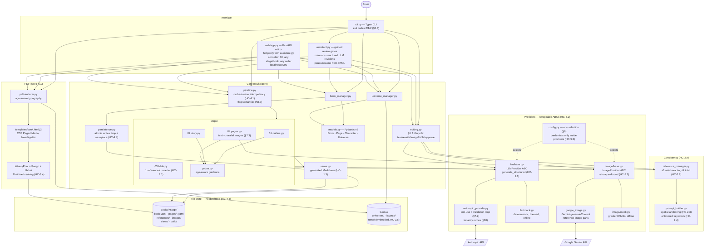
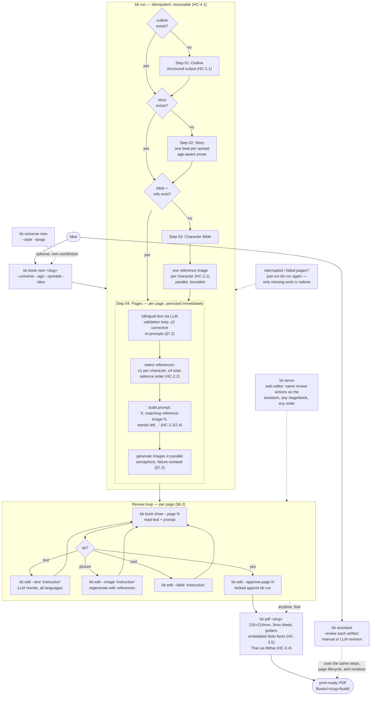
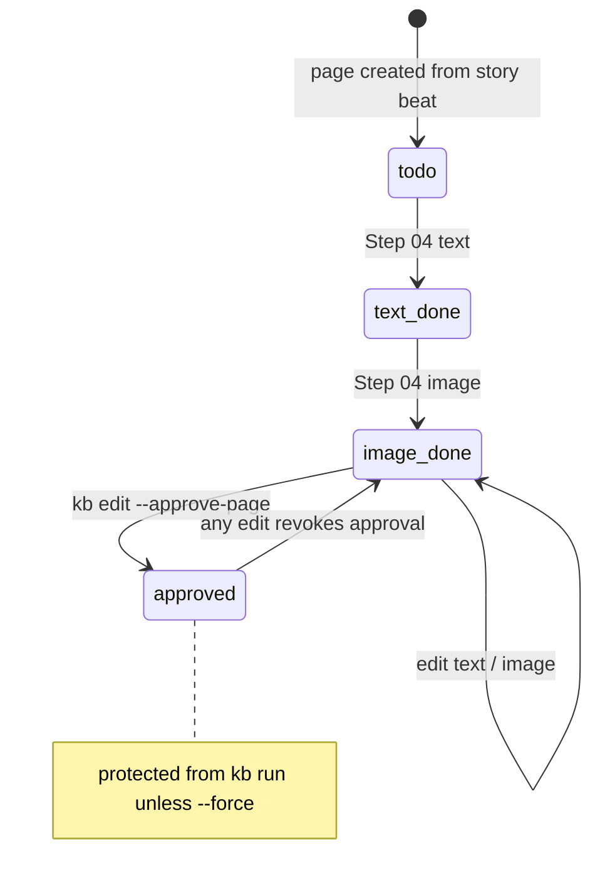

# kb — Architecture & Workflow

Rendered natively by GitHub (Mermaid). Companion documents: [MANUAL.md](MANUAL.md)
for every command/flag, [implementation-spec.md](../implementation-spec.md) for
requirements (HC-x.y).

## 1. Architecture — how the tool is built

Key properties: all state is plain YAML/PNG under `Books/<slug>/` (portable,
diffable); every write is atomic; providers are selected via environment and
hold their own credentials; the mock providers make the entire pipeline run
offline at zero cost — that is what the test suite and phase gates use.

## 2. Workflow — from idea to printed book

Page lifecycle underlying the whole flow:

